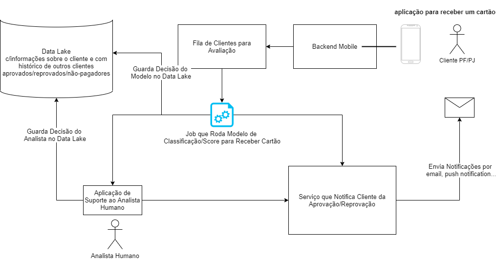
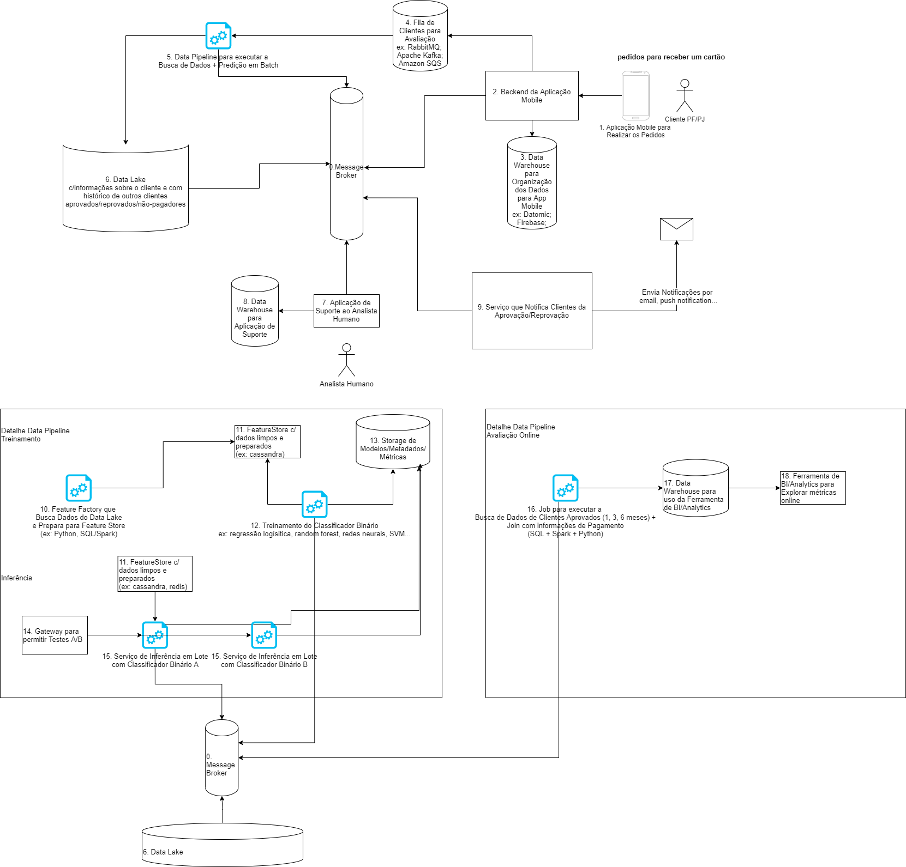

## Nubank

Questões que eu elaborei antes da entrevista após assistir o vídeo [Nubank Data Science team and career](https://www.youtube.com/watch?v=8K6tS4xNrJU) e ler o [blog do Nubank](https://blog.nubank.com.br/tag/data-science/). 
Veja as [Informações Importantes](#informações-importantes) para ajudar com as respostas.

### 1. Como você criaria um modelo para decidir quem deve receber cartão de crédito (e quem não deve receber)? 
**Perguntas para iniciar a conversa (entender o problema e definir o escopo do design):**
<!--
Partner with the interviewer to narrow the system definition down and understand which aspects of the design should be the focus of the conversation. At first, understand the general aspects of the system:
Para que o sistema será usado?
Qual objetivo ele tenta alcançar?
Quem são os usuários? Como eles irão acessar o sistema ou quais são os pontos de entrada?
Quais são as entradas e saídas do sistema?
Escalabilidade deve ser uma preocupação neste momento?
Quais componentes do sistema devem ter o maior foco de discussão?
Quais tecnologias, estruturas de dados, ou algoritmos são úteis para este cenário?
-->

- Onde modelo será usado?
  - como ferramenta de auxílio a um analista;
  - num processo semi-automatizado de aprovação em que acima de um limiar é aprovado e abaixo vai para análise humana;
- Qual o objetivo de negócio quero otimizar?
  - aumentar o número de pessoas aprovadas sem aumentar o risco de não-pagamento;
- Qual a expectativa de latência (tempo de resposta) e de acessos concorrentes (throughput)?
  - 50000 novas aplicações por dia; ~35 por minuto
- Consigo realizar o objetivo sem um modelo de ML?
  - posso aplicar regras de renda mínima, score mínimo, máximo de dívidas;
- Quais os dados que tenho disponível?
  - ex: histórico de perfis aprovados e reprovados;
  - informações de renda e score do cliente;
- Quem são os usuários?
  - analistas do Nubank e os clientes do Nubank;
- Como eles irão acessar o sistema?
  - analista acessa através de uma aplicação web; cliente acessa através do smartphone;
- Quais componentes do sistema devem ter o maior foco de discussão?
  - ex: pipeline de dados;

**Solução de Alto-Nível:** 

<!--You’ll call out the types of models (eg. binary classifier) and how the system will be evaluated (eg. offline evaluation of increasing retention via A/B test.)-->

- Tipo de Modelo: Classificação Binária (1 - deve receber cartão; 0 - não deve receber cartão)
- Avaliação Offline:
  - target: 1 (cliente aprovado e bom pagador); 0 (cliente reprovado ou cliente aprovado e mau-pagador)
  - precision (prioriza não aprovar maus pagadores a custa de reprovar bons pagadores)
  - recall (prioriza não reprovar bons pagadores, a custa de aprovar alguns maus pagadores)
  - f-score (faz um balanço entre precision e recall)
  - dificuldade: falta de informação de falsos negativos (clientes que seriam bons pagadores e foram reprovados)
  - dificuldade: se dados históricos foram obtidos com um modelo, os labels vão possuir o viés daquele modelo
- Avaliação Online:
  - Taxa de Maus Pagadores Aprovados em 1, 3, 6 meses;
  - Média de Gastos dos Clientes Aprovados em 1, 3, 6 meses;
  - Ganho com Clientes Aprovados (dá pra medir isto?);
  - Métricas de Software: % de erros, tempo de resposta (atraso), throughput

**Componentes da Arquitetura:** 

- Tipo de Modelo em Produção: Predição em Batch.
Infraestrutura necessária:

0. Message Broker
  - Por que um Message Broker? Para permitir comunicação entre micro-serviços; Permite processamento assíncrono; permite distribuir processamento se necessário; melhor escalabilidade; permite "filtrar" pelas mensages de interesse;
  - ex: Kafka, Amazon SQS
1. Aplicação Mobile para Realizar os Pedidos
2. Backend da Aplicação Mobile
3. Data Warehouse para Organização dos Dados para App Mobile
4. Fila para receber os pedidos para receber cartão (producer: backend mobile; consumers: jobs de "enriquecimento de dados" + predição, data lake, aplicações dashboard;)
  - Por que uma fila? Permite processamento assíncrono; permite distribuir processamento se necessário; permite "filtrar" pelas mensagens de interesse;
  - ex: RabbitMQ, Apache Kafka; Amazon SQS
5. Data Pipeline para executar a Busca de Dados + Predição em Batch
  - Por que predição em batch? A resposta do usuário não precisa ser instantânea; Predição em batch é mais eficiente;
  - Dificuldades: precisa de dados confiáveis, então não deve consultar os dados   "raw" do Data Lake;
  - Exemplos: Kubeflow Pipelines, Airflow; Google DataProc;
6. Data Lake c/informações sobre o cliente e com histórico de outros clientes aprovados/reprovados/não-pagadores
  - Por que um Data Lake? estabelece um local unificado de acesso aos dados; dá flexibilidade sobre a estrutura/qualidade dos dados;
  - ex: HDFS (+Spark); S3 + Athena;
7. Aplicação de Suporte ao Analista Humano
8. Data Warehouse para Aplicação de Suporte
9. Serviço que Notifica Clientes da Aprovação/Reprovação
10. Feature Factory que Busca Dados do Data Lake e Prepara para Feature Store
  - restrição de acesso apenas aos dados estritamente necessários
  - ex: Python, SQL/Spark
11. FeatureStore c/ dados limpos e preparados
  - ex: cassandra, redis (cache caso precise de um atraso ainda menor)
12. Treinamento do Classificador Binário
  - ex: regressão logísitica, random forest, redes neurais, SVM...
13. Storage de Modelos/Metadados
  - ex: S3, MinIO, MLFlow, HDFS.
14. Gateway para permitir Testes A/B
  - ex: Istio (Kubernetes)
15. Serviço de Inferência em Lote com Classificador Binário A
16. Job para executar a Busca de Dados de Clientes Aprovados (1, 3, 6 meses) + Join com informações de Pagamento (SQL + Spark + Python)
17. Data Warehouse para uso da Ferramenta de BI/Analytics
18. Ferramenta de BI/Analytics para Explorar métricas online
  - Por que uma ferramenta de BI? para informar visualmente, para prover uma interface "no code" para analistas;

**O que pode dar errado?**
- TODO

**Como posso iterar neste modelo/experimento/problema?**
- TODO

<!--
Here’s where you’ll want to cover some advanced topics like how the system development could be split between different teams, long term ways the system could evolve to meet future business needs, common components that could be reused by different products, real world issues like regionalization or data schema migrations.
-->

### 2. Como abordar o problema para decidir o limite de crédito dado a um cliente? E para decidir uma solicitação de aumento de crédito? 

Algumas ideias são deste post: https://blog.nubank.com.br/limite-cartao-nubank/ 
**Objetivos de negócio:**
- diminuir o risco de default (não-pagamento)
- aumentar a média de gastos por mês
- aumentar o número de produtos que o cliente utiliza
- aumentar o NPS (net promoter score)
- TODO

**Dados necessários:**
- Renda do cliente
- Perfil de uso do cartão (ex: média de gastos nos últimos 1, 3, 6 , 12 meses...)
- Score do cliente (Serasa)
- Histórico de atrasos e não-pagamentos
- Dados de Open-Banking/Compartilhados entre instituições financeiras
- Histórico de Parcelamentos de Fatura
- TODO

**Testes e experimentos:**
- TODO

**Sugestão de algoritmo/pipeline de ML:**
- TODO

**Métricas de negócio:**
- TODO

**Métricas de ML:**
- TODO

**O que pode dar errado?**
- TODO

**Como posso iterar neste modelo/experimento/problema?**
- TODO

### 3. Dado um dataset de informações de compra com cartão de crédito, com cada amostra rotulada como fraude/não-fraude, como construir um algoritmo de detecção de fraude? 

**Objetivos de negócio:**
- TODO

**Dados necessários:**
- TODO

**Testes e experimentos:**
- TODO

**Sugestão de algoritmo/pipeline de ML:**
- TODO

**Métricas de negócio:**
- TODO

**Métricas de ML:**
- TODO

**O que pode dar errado?**
- TODO

**Como posso iterar neste modelo/experimento/problema?**
- TODO

### 4. Risco de Crédito (quando a pessoa entra; após 3 meses;) 
**Objetivos de negócio:**
- Diminuir o risco de não-pagamento
- Usar uma estratégia mais efetiva de cobrança
- TODO

**Dados necessários:**
- como ela gasta dentro e fora do país
- TODO

**Testes e experimentos:**
- TODO

**Sugestão de algoritmo/pipeline de ML:**
- TODO

**Métricas de negócio:**
- TODO

**Métricas de ML:**
- TODO

**O que pode dar errado?**
- TODO

**Como posso iterar neste modelo/experimento/problema?**
- TODO

### 5. Como construir um modelo para auto-reply de chat e email? 

Algumas ideias são deste vídeo: [Classificação de textos com Redes Neurais Convolucionais | Nubank ML Meetup](https://www.youtube.com/watch?v=TRhocAMGCfc) 

**Objetivos de negócio:**
- Aumentar eficiência das operações e manter um alto nível de satisfação do cliente
- Tempo para primeira resposta
- Tempo do primeiro contato até a solução do problema
- TODO

**Dados necessários:**
- Histórico de Mensagens (de Email/Chat) de Usuários e Respostas
- É possível usar informação contextual. Ex: reissue-error, card-delivered, delivery error. 
- Modelos de Língua Pré-Treinados (Ou dados utilizados para treiná-los)
- TODO

**Testes e experimentos:**
- TODO

**Sugestão de algoritmo/pipeline de ML:**
- Posso utilizar embeddings pré-treinados + modelo de classificação.
- *Pode ser necessário aplicar regras junto com ML (ex: cliente em atraso não recebe resposta)
- TODO

**Métricas de negócio:**
- TODO

**Métricas de ML:**
- TODO

**O que pode dar errado?**
- dados sem rótulo;

**Como posso iterar neste modelo/experimento/problema?**
- Aumentar o número de tópicos que consigo responder

### 6. Modelos para marketing. (pra quem eu ligo para tentar uma venda?) 
**Objetivos de negócio:**
- TODO

**Dados necessários:**
- TODO

**Testes e experimentos:**
- TODO

**Sugestão de algoritmo/pipeline de ML:**
- TODO

**Métricas de negócio:**
- TODO

**Métricas de ML:**
- TODO

**O que pode dar errado?**
- TODO

**Como posso iterar neste modelo/experimento/problema?**
- TODO

### 7. Imagine que uma empresa de telecomunicações entra em contato com você comentando que gostaria de saber a quais clientes deveria de ofertar um serviço adicional de internet. Você sabe que eles possuem uma base com um teste feito no passado para uma base aleatória de quais clientes receberam essa proposta e o resultado obtido do mesmo. Como você abordaria esse problema? 
**Objetivos de negócio:**
- TODO

**Dados necessários:**
- TODO

**Testes e experimentos:**
- TODO

**Sugestão de algoritmo/pipeline de ML:**
- TODO

**Métricas de negócio:**
- TODO

**Métricas de ML:**
- TODO

**O que pode dar errado?**
- TODO

**Como posso iterar neste modelo/experimento/problema?**
- TODO

### Informações Importantes
- [Blog do Nubank](https://blog.nubank.com.br/tag/data-science/)
- [Nubank Data Science team and career | Nubank ML Meetup](https://www.youtube.com/watch?v=8K6tS4xNrJU)
- [What's a useful model? Insights from a customer service perspective | Nubank Machine Learning Meetup](https://www.youtube.com/watch?v=LNe2m5Aw9gY) 
  - Quando não usar modelos de ML?
    - Quando quiser minimizar erros custosos. ex: não deixar um modelo de nlp encerrar contas do Nubank). 
    - Quando tiver que manter transparência máxima sobre as decisões.
  - O que faz um bom produto de ML?
    - Ver [People + AI Guidebook do Google](https://pair.withgoogle.com/guidebook/)
    - Deixa claro o que é capaz de fazer (segue os modelos mentais dos clientes)
    - Deixa claro porque fez (explicabilidade, leva em conta viéses sociais)
    - Dá feedback, permite controle pelos usuários, aprende com comportamento do usuário
    - Lida com falhas/erros gracefully
- Datasets financeiros tem muita influência do tempo (ex: feriados, final de ano, eleições...)

### Assuntos com os quais um MLE precisa se preocupar:
**Nas provas de conceito:**
- Criar hipóteses de negócio (qual o impacto do modelo)
- Estipular quais dados serão necessários (e como coletá-los, se necessário)
- Definir testes e experimentos
- Versionamento de código
- Criar pipelines de CI/CD
- Criar Testes Unitários:
  - testar corretude dos algoritmos, ex: overfitting de poucas amostras
  - sanity-test: 1 predict com amostra aleatória ou pré-definida 
  - testar se há variações significativas em métricas (comparado com versões anteriores do código)
  - dever ser rápidos, e execução pode estar atrelada a um commit/push/pull-request
  - compatibilidade de versões de bibliotecas
  - Training/Serving skews (Schema Skews)
- Criar Testes de Integração (Rodar Pipeline fim-a-fim com um subconjunto de dados). Geralmente é demorado. Pode rodar periodicamente (ex: 1 vez ao dia).
- Realizar várias execuções e tirar a média dos resultados
- Tracking
  - parâmetros/hiperparâmetros/features
  - métricas e gráficos
  - dependências de software
  - training/validation/test sets
  - estatísticas/importância relativa de cada feature
  - quem treinou o modelo/motivação
- Storage de modelos
- Construir um modelo baseline: data prep., algoritmos, arquiteturas, optimizer, regularization, batch size, avaliação offline/online...
- Sugerir como utilizar o modelo em produção (Batch Job/Real Time? Shadow Mode/AB Testing...)
- Por quanto tempo validar o modelo?
- Gerar hipóteses do que pode dar errado (problemas com qualidade de dados, data e concept drift, ...)
- Decidir como monitorar o modelo em produção (métricas de negócio, de ML, de Software...)
- Como eu posso iterar nesse modelo e na concepção do problema/hipóteses? Preciso capturar mais dados? (ex: no problema de chat foi necessário capturar feedback explícito se o usuário ficou satisfeito)
- Como eu posso usar os dados que coletei nos testes. Existem problemas de feedback loop? (resposta do modelo em operação enviesa futuros modelos?)

**Quando o modelo estiver em produção:**
- Minimizar riscos de execução. 
- O modelo está funcionando direito? Tem alguma regra que está atrapalhando as coisas?
- O dado está sendo ingerido no lake/warehouse?
- Tem alguma informação faltando?
- O modelo está gerando scores adequadamente? 
- Está rodando rápido o suficiente?
- Se não for possível estimar um ganho com um modelo, sugerir caminhos para melhorar a estimativa de valor entregue pelo modelo: fazer pesquisas, rankear qual projeto é o mais importante;
- Qual o valor ganhado por atualizar o modelo (com mais dados, mais features)
- Logging
- Como lidar com indisponibilidade
- Alertar quando há problemas
- Servir dados para modelos em realtime: batch compute + cache (cassandra/redis);

**Arquitetura:**
- Data pipeline
  - Data Lake (mantém dados brutos, recebe eventos/logs o tempo todo). Vantagens: qualquer tipo de dado, mais barato. Alternativas: S3, GCS, Hadoop
  - Data Warehouse (re). Vantagens: qualidade de dados, schema, velocidade. Desvantagens: apenas dados estruturados. Alternativas: Big Query, Redshift, DynamoDB, Cassandra.
  - Data/Feature "factory" (by query).
- Model management
  - Model/Experiment tracking
  - Data leak
  - Tuning de hiperparâmetros
  - Validação de modelo (corretude do algoritmo)
  - Model Deployment (strategy)
- Model deploy
  - Real-Time. Vantagens: alta disponibilidade, pode até rodar embarcado (sem rede). Desvantagens: necessita de uma camada de cache para dados, maior preço, maior complexidade, exige monitoramento, failover.
  - Batch/Job. Vantagens: menor custo, pode usar uma solução mais tradicional/barata de BD. Desvantagens: demora.
  - Podem acontecer por webservice ou trigger
  - Logs: 
Data Lake -> 

## Outros
Casos de estudo retirados do [Machine Learning Systems Design](https://huyenchip.com/machine-learning-systems-design/toc.html). 

### 1. Duolingo is a platform for language learning. When a student is learning a new language, Duolingo wants to recommend increasingly difficult stories to read.
How would you measure the difficulty level of a story?
Given a story, how would you edit it to make it easier or more difficult?

### 2. Given a dataset of credit card purchases information, each record is labelled as fraudulent or safe, how would you build a fraud detection algorithm?

### 3. You run an e-commerce website. Sometimes, users want to buy an item that is no longer available. Build a recommendation system to suggest replacement items.

### 4. For any user on Twitter, how would you suggest who they should follow? What do you do when that user is new? What are some of the limitations of data-driven recommender systems?

### 5. When you enter a search query on Google, you're shown a list of related searches. How would you generate a list of related searches for each query?

### 6. Build a system that return images associated with a query like in Google Images.

### 7. How would you build a system to suggest trending hashtags on Twitter?

### 8. Each question on Quora often gets many different answers. How do you create a model that ranks all these answers? How computationally intensive is this model?

### 9. How to you build a system to display top 10 results when a user searches for rental listings in a certain location on Airbnb?

### 10. Autocompletion: how would you build an algorithm to finish your sentence when you text?

### 11. When you type a question on StackOverflow, you're shown a list of similar questions to make sure that your question hasn't been asked before. How do you build such a system?

### 12. How would you design an algorithm to match pool riders for Lyft or Uber?

### 13. On social networks like Facebook, users can choose to list their high schools. Can you estimate what percentage of high schools listed on Facebook are real? How do we find out, and deploy at scale, a way of finding invalid schools?

### 14. How would you build a trigger word detection algorithm to spot the word "activate" in a 10 second long audio clip?

### 15. If you were to build a Netflix clone, how would you build a system that predicts when a user stops watching a TV show, whether they are tired of that show or they're just taking a break?

### 16. Facebook would like to develop a way to estimate the month and day of people's birthdays, regardless of whether people give us that information directly. What methods would you propose, and data would you use, to help with that task?

### 17. Build a system to predict the language a text is written in.

### 18. Predict the house price for a property listed on Zillow. Use that system to predict whether we invest on buying more properties in a certain city.

### 19. Imagine you were working on iPhone. Everytime users open their phones, you want to suggest one app they are most likely to open first with 90% accuracy. How would you do that?

### 20. How do you map nicknames (Pete, Andy, Nick, Rob, etc) to real names?

### 21. An e-commerce company is trying to minimize the time it takes customers to purchase their selected items. As a machine learning engineer, what can you do to help them?

### 22. Build a chatbot to help people book hotels.

### 23. How would you design a question answering system that can extract an answer from a large collection of documents given a user query?

### 24. How would you train a model to predict whether the word "jaguar" in a sentence refers to the animal or the car?

### 25. Suppose you're building a software to manage the stock portfolio of your clients. You manage X amount of money. Imagine that you've converted all that amount into stocks, and find a stock that you definitely must buy. How do you decide which of your currently owned stocks to drop so that you can buy this new stock?

### 26. How would you create a model to recognize whether an image is a triangle, a circle, or a square?

### 27. Given only CIFAR-10 dataset, how to build a model to recognize if an image is in the 10 classes of CIFAR-10 or not?
